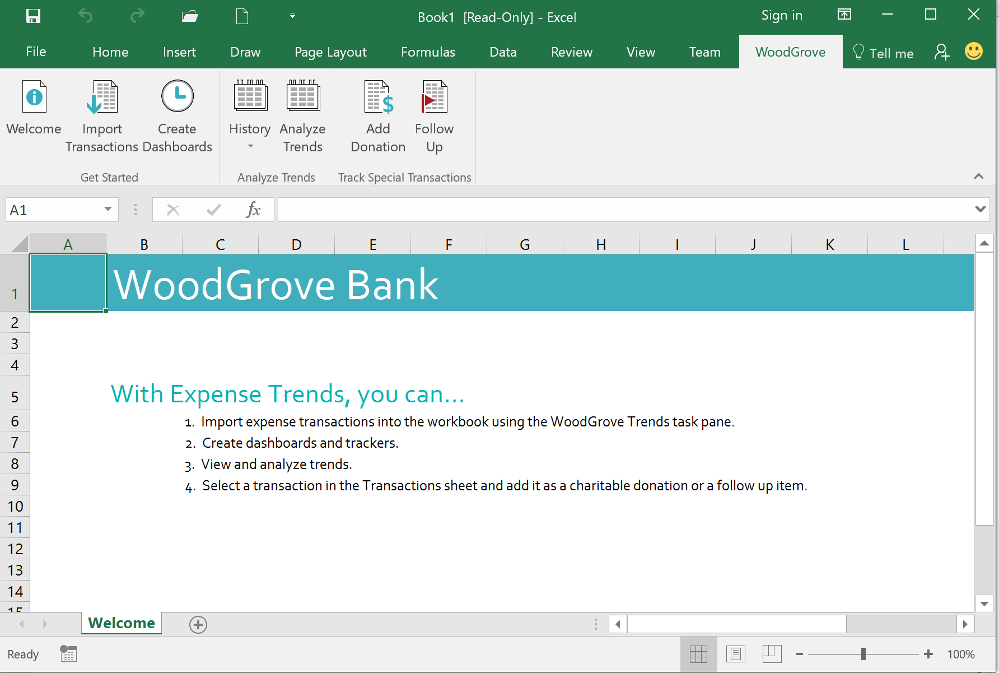

# Excel-Add-in-JS-WoodGrove-Expense-Trends

Das WoodGrove Bank Expense Trends-Add-In veranschaulicht die Verwendung der neuen JavaScript-API für Microsoft Excel 2016 zum Erstellen eines überzeugenden Excel-Add-Ins. Mit Expense Trends können Sie Ausgabentransaktionen in die Arbeitsmappe importieren, Dashboards und Tracker erstellen, Trends anzeigen und analysieren, besondere Transaktionen nachverfolgen z. B. Spenden, und Elemente nachverfolgen. Das Beispiel enthält zwei Szenarien: eins mit Aufgabenbereich und eins mit Add-In-Befehlen. In der folgenden Abbildung werden zwei wichtige Bildschirme des Add-Ins dargestellt.

## Inhalt

* [Voraussetzungen](#prerequisites)
* [Ausführen des Projekts](#run-the-project)
* [Zusätzliche Ressourcen](#additional-resources)

## Voraussetzungen

Sie benötigen Folgendes:

* [Visual Studio 2015](https://www.visualstudio.com/downloads/download-visual-studio-vs.aspx)
* [Office Developer Tools für Visual Studio](https://www.visualstudio.com/en-us/features/office-tools-vs.aspx)
* Excel 2016, Version 6769.2011 oder höher

## Ausführen des Projekts

1. Kopieren Sie das Projekt in einem lokalen Ordner. Stellen Sie sicher, dass der Pfad nicht zu lang ist, andernfalls können in Visual Studio bei beim Installieren der für das Projekt erforderlichen NuGet-Pakete Fehler auftreten. 
2. Öffnen Sie dann `WoodGrove Expense Trends.sln` in Visual Studio. 
3. Drücken Sie F5, um das Beispiel-Add-In zu erstellen und bereitzustellen. Excel wird gestartet, und je nach Version von Excel 2016, lädt das Add-In entweder eine benutzerdefinierte Registerkarte „WoodGrove“ im Menüband, oder es wird in einem Aufgabenbereich rechts neben dem Arbeitsblatt geöffnet, wie in der folgenden Abbildung gezeigt.

![WoodGrove Bank Expense Trends Add-in - Initial taskpane] (../images/woodgrove_taskpane_ribbon.PNG)

![WoodGrove Bank Expense Trends Add-in - Initial taskpane] (../images/woodgrove_taskpane_import.PNG)

## Zusätzliche Ressourcen

* [Office Dev Center](http://dev.office.com/)

## Copyright
Copyright (c) 2016 Microsoft. Alle Rechte vorbehalten.

In diesem Projekt wurden die [Microsoft Open Source-Verhaltensregeln](https://opensource.microsoft.com/codeofconduct/) übernommen. Weitere Informationen finden Sie unter [Häufig gestellte Fragen zu Verhaltensregeln](https://opensource.microsoft.com/codeofconduct/faq/), oder richten Sie Ihre Fragen oder Kommentare an [opencode@microsoft.com](mailto:opencode@microsoft.com).
